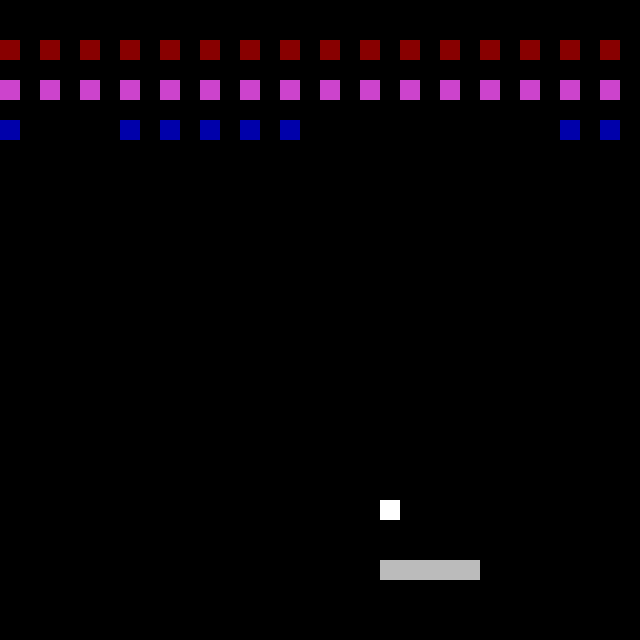
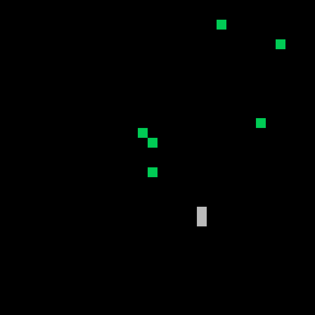

## 6502 Assembly Games

I recently came across [Easy6502](http://skilldrick.github.io/easy6502/) by [Nick Morgan](https://github.com/skilldrick) about 6502 assembly. I have only learned a little bit of RISC-V assembly in my college classes, and I have always wanted to create something more fun than the boring examples provided in course materials. While the 6502 is very different from modern computer architectures, the foundational computing principles are the same. So I decided to challenge myself and learn something new by trying to recreate games in 6502 assembly.

You can try running these games using the included simulator inside `/sandbox`, which is based on Easy6502 (licensed under the [Creative Commons Attribution 4.0 International License](https://creativecommons.org/licenses/by/4.0/)).

### [Snake](snake.asm)

Snake game modified from the example by Nick Morgan. The grid size is now 2x2, and you can warp around the walls.

### [Breakout](breakout.asm)

Classic Breakout game. This was my first attempt at creating a game from scratch in 6502 assembly. I thought it wouldn't be that difficult, after all there are only like about one page worth of instructions. Oh boy, how wrong I was. This took me almost a week to make. Maybe I am just not cut out for this.

### [Meteor Dodge](meteor_dodge.asm)

This was supposed to be Space Invaders, but I accidentally created diagonal enemies/meteors. I quite liked them, so I decided to make a different game.

