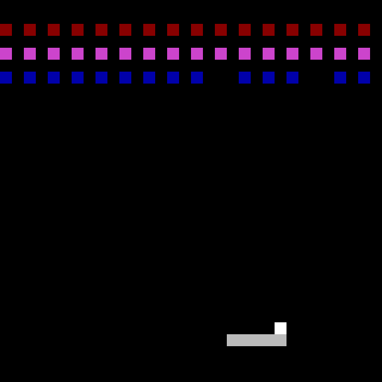

## Breakout6502

I recently came across [Easy6502](http://skilldrick.github.io/easy6502/) by [Nick Morgan](https://github.com/skilldrick) about 6502 assembly. I have only learned a little bit of RISC-V assembly in my college classes, and I have always wanted to create something more fun than the boring examples provided in course materials. While the 6502 is very different from modern computer architectures, the foundational computing principles are the same. So I decided to challenge myself and learn something new by trying to recreate Breakout.

You can try running the game using the provided simulator HTML, which is based on Easy6502 with some modification (by "some modification,” I mean I added a speed slider, since the original speed was a bit too slow) licensed under the [Creative Commons Attribution 4.0 International License](https://creativecommons.org/licenses/by/4.0/).

